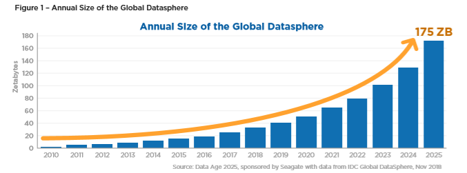
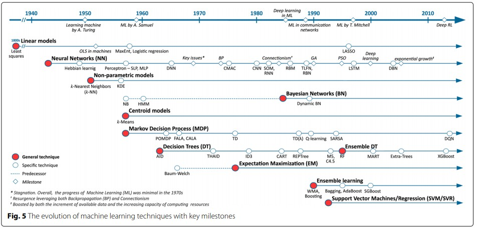
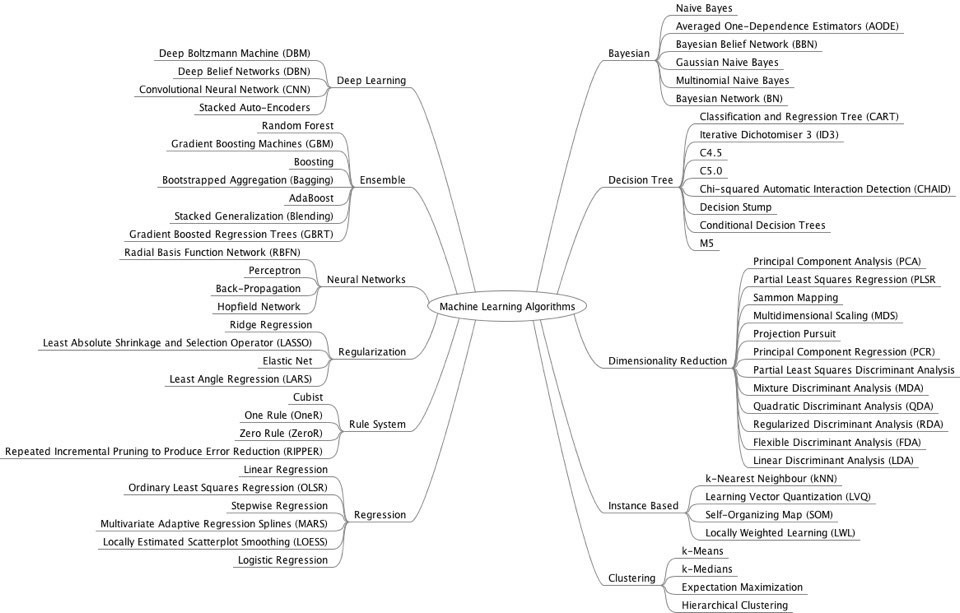

---
&nbsp; &nbsp; **목차** 
&nbsp; &nbsp; 1. [통계는 어떻게 현실 문제를 해결하고 머신러닝은 또 뭘까?](#1) 

---
 

## 1. 통계는 어떻게 현실 문제를 해결하고 머신러닝은 또 뭘까? 
 
우리 주변에는 다양한 **데이터**가 있다. 앞사람의 머리카락 색, TV 속 연예인 목소리의 리듬과 톤, 도로 위 교통 상황과 자동차의 위치 등이다. 이들은 객관적 사실로서 어디에나 존재하지만 누구도 거기에 특별한 의미를 부여하지 않는다. 그러나 누군가가 이것을 이용해야할 때(관심이 있을 때), 예를 들면 도로 주행의 최단거리를 찾거나 어떤 머리카락 색이 어뗜 효과를 주는지 찾는 등의 질문 거리에 대한 답을 찾고 싶을 때, 평범한 사실을 의미를 가진 **정보**의 집단으로 처리될 수 있다. 그리고 어떤 정보 집단이든 내부 숫자에 대한 통계를 낼 수 있다. 이때, 많은 데이터는 연속적인 숫자이지만, 또다른 많은 데이터는 범주로 주어지거나 (yes or no) 물질적 항목 그 자체이다. 이것은 어떻게 숫자일까? 정의를 조금 다르게 내려보면 된다. 진한 갈색은 1, 그냥 갈색은 0.7, 연한 갈색은 0.4 처럼, 마치 자로 재듯 **척도**를 가지고 **측정**을 할 수 있다. 그리하여 이 숫자들로는 통계를 낼 수 있다. 즉, 어떤 집단의 자료를 정리, 요약해서 그 집단을 설명할 수 있는 수치를 찾을 수 있고, 때때로 그 수치로부터 보다 광범위한 집단을 타당하게 설명(추정) 할 수도 있고, 시간이나 공간 등의 조건이 다를 때의 집단이 어떻게 변할지 타당하게 추정해볼 수도 있다. 즉 평균과 분산을 가지고, 확률분포를 가정할 수 있고, 여러가지 법칙과 정리도 따르며, 추정이나 검정이 가능하다. 

  

어떤 현상을 수학적으로 표현하면 패턴과 법칙을 발견하는데 편리하다. 통계적인 방법을 사용하면 각종 현상을 설명하고 추측하는데 유리하다. 통계적 분석이란 건 여러가지 문제를 해결하는 이 꽤 괜찮은 방법들을 한데 모아 '분석'이라는 단어를 붙인 듯하다. 

  

회귀분석은 전통적으로 사용하던 통계적 분석 방법이다. 더 간단하고 모두가 들어봤을 예시는 평균과 표준편차이다. 수능을 치면 주어지던 표준점수가 이 기본 통계 지식을 적용해 학생들의 시험점수를 통계적으로 분석한 결과이고, 그 결과와 그외 평가지표를 취합해서 대학은 각 학생의 합격과 불합격을 논리적으로 타당하게 선고한다. 물론 그러한 대학입시 과정의 타당성에 대해서야 논리의 다툼이 있을 수 있겠다. 아무튼 지금 말하고자 하는 내용은 통계적 분석 방법은 합리적인 의사결정을 하기 위해 이용된다는 것이다. 수학과 통계학은 '현상'을 수식으로 표현하기 위해 상상력을 발휘한다. 문제를 풀고 싶으면 그에 맞는 모델링을 하고 해당 방정식의 해를 찾으면 된다. 자연 또는 사회현상에 대해서 추론하고 불확실한 미래를 대비해서 결정을 내릴 때, 훌륭한 수학자와 통계학자들이 오랜기간에 걸쳐 증명한 과학적인 방법을 이용한다면 꽤 듬직하고 효과적인 무기가 될 것이다. 특히 통계학은 사람이었다면 상상하지 못했을 직감에 반하는 진실을 드러내기도 하며, 사람은 그로 인해 성장할 수 있다. 

  

  

머신러닝 혹은 기계학습의 역사에 대한 글도 언젠가는 작성하고 싶은데, 대략 1949년 Hebb이 Hebbian Learning Theory를 발표하는 데서 시작됐다고 한다. 그 기술이 갑자기 발전하게 된 계기는 근 몇년 사이에 이뤄진 하드웨어나 소프트웨어의 발달이라고 생각한다. 전세계에서 생성되는 데이터 총량은 위 그래프처럼 '기하급수적'으로 변화했다. 2010년에 0.xZB, 2016년엔 거의 20ZB, 2018년엔 약 33ZB였다고 한다. 분석 능력을 갖춘 하드웨어도 급격히 발달했다. 이런 데이터를 거두어들일 수 있는 기업도 많아졌고, 학문적인 업적을 산업에서 이용하려는 시도도 함께 증가한 덕에, 통계적 분석 방법을 용용한 머신러닝 기술이 각광을 받고 있는 것같다. 데이터가 증가하면 분석의 정확도가 올라가는 것은 덤이다. 머신러닝은 인간의 학습방법 중 하나처럼, 기계가 경험을 통해 '사고'하는 것을 목표로 하는 터라 전통적인 통계학과는 맥이 조금 다르다. 그러나 여느 응용 방법이 그렇듯, 기초지식이 어떻게 응용이 되었는지를 파악하면 보다 정확하게 활용할 수 있고, 새로운 응용을 건축해볼 수도 있을 것이다. 마침 필자는 통계학과 머신러닝의 기초적인 부분을 배울 기회가 있었고, 이를 바탕으로 기초 통계가 어떻게 머신러닝으로 응용될 수 있는지에 대해 정리해보려고 한다.

  

  

## 2. 머신러닝 기법의 종류? 

 

앞서서는 통계가 어떻게 현실에서 활용되는지와 머신러닝의 목표는 무엇인지 간단히 적었고, 이번에는 구체적으로 어떤 기법들로 데이터 분석을 하는지 그 종류를 정리하려고 한다. 우선 **통계학**의 종류를 크게 두 가지로 나눠볼 수 있다. 첫째는 **기술통계학**으로, 자료의 양이 방대한 경우, 자료의 전반적인 내용을 쉽게 파악하기 위해 정리, 요약하는 방법을 다루는 분야이다. **탐색적 데이터분석**이라고도 부르며 데이터를 가지고 있다면 기본적으로 시행해둬야 한다. 두 번째는 **추측통계학**으로, 모집단의 일부분인 표본 집단을 실제로 관측해서 정보를 분석한 후 모집단의 여러 가지 특성에 대해 과학적으로 추론하는 방법을 다루는 분야이다. 처음 배울 때 확률분포, 추정, 검정, 회귀분석, 분산분석, 시계열분석 등이 다루고, 머신러닝에서 응용되는 분야는 주로 이쪽이다.

  

머신러닝은 응용수학과 컴퓨터과학 분야의 내용도 포함한다. 데이터는 그 규모가 폭발적일 뿐 아니라, 하드웨어의 발달로 종류마저 한계를 뛰어넘었다. **정형데이터**라 불리던 표에 정리된 기존의 데이터와는 구분되어, **비정형데이터**인 이미지, 텍스트, 음성 등도 과거보다 효과적으로 분석 가능하게 된 까닭이다. 특히 CNN, RNN 이라 불리는 기법에서 발전해나간 많은 딥러닝 기법들이 비정형데이터 분석에 활용된다. 딥러닝은 신경망 기법(Neural Networks)의 응용으로 머신러닝의 일부이기도 하지만 컴퓨터과학의 컴퓨터 비전, 자연어처리 등의 분야에서 워낙 널리 연구되어서인지 독자적인 개념으로도 자주 언급되고, 그래서 따로 떼어 먼저 작성했다.

  

이제서야 본론으로 들어가보면 머신러닝은 분석의 목표에 따라 크게 **1. 탐색적 데이터 분석(EVT), 2. 분산분석(ABT), 3. 분류예측과 수치예측(CRT), 4. 유형화와 네트워킹 분석(GNT), 5. 딥러닝과 강화학습**으로 나뉘는 듯하다. **분산분석**은 사실 집단 간의 차이를 분석하는 통계학 내용이다. AB test라고도 하며, 비즈니스에 적용해 두 가지 이상 아이템의 효과 차이를 추론할 수 있다. **수치예측분석**은 주로 회귀(Regression)모델을 만들어 데이터를 학습시킨후 새로운 데이터의 수치를 예측하고, **분류예측분석**은 회귀모델을 변형하거나 Tree모델 등을 통해 변수가 어떤 범주에 속할지 예측한다. CRT는 데이터에 대한 정보가 미리 지도(정의)된 후 기계가 지도 내용과 데이터 간의 규칙을 학습하고, 새로운 데이터에 대해 이게 0인지 1인지 알아보게 하는 터라 지도학습으로 불리곤 한다. **유형화와 네트워킹 분석**은 군집분석, 연관성분석, 주성분분석, 요인분석, 네트워크 분석 등을 포함하며, 기계는 라벨링 되지 않은 데이터 사이의 규칙을 학습하고 데이터를 클러스터로 분할하거나 정보를 알려주는터라 비지도 학습으로 불리곤 한다. 큰 가지로 분류해보기는 했지만 사실 세부 내용은 몹시 방대하고, 주어진 데이터의 종류가 연속적 수치데이터인지, 범주형데이터(이항형, 다항형, 서열형)인지에 따라 적용할 수 있는 분석 기법이 또 달라진다. 

  

  

기업이 머신러닝을 이용하는 내용은 대략 다음처럼 예시를 들어보고 싶다. 기본적으로 데이터에 대한 기술통계분석을 마친 후, ABtest를 통해 A상품과 B상품 중 어떤 것이 더 팔기 좋을지 선정한다. 누구에게 팔고, 어떻게 팔지에 도움을 주는 데에서 분류예측과 수치예측이 개입된다. 특정 집단이 A에 대해서 어느 정도 수치로 구매할 것인지, 혹은 특정 집단이 할인행사에 참여하는 고객인지 아닌지 등을 예측해볼 수 있다. 이때 다양한 비지도학습을 이용해서 종속변수에 영향을 미치는 것으로 설정한 독립변수가 너무 많으면 **차원축소**라는 표현을 쓰며 변수를 줄일 수 있고 고객군이나 상품군을 이런 저런 종류로 군집으로 만들어볼 수도 있다. 여러 집단이 생기면 연관성 분석 등으로 개연성과 유사성을 찾아 상품 추천 알고리즘을 찾는 식으로 머신러닝은 비즈니스에 도움을 주곤 한다.(고 그러더라.: 필자는 그냥 배워서 아는 내용임)

  

EVT: Exploratory & Visualization Test |  
ABT: A&B item Difference Test | 분산분석(ANOVA) 등등
CRT: Classification & Regression | Regression, Decision Tree(CART), Ensemble(Random Forest, Gradient Boosting Machines), Support Vector Machine, k-Nearest Neighbour, Naive Bayes, 시계열분석 등등
GNT: Grouping & Networking | Clustering(K-means, Hierarchical), PCA, FA 등등

  

###### <참고 문헌> 
 
1. 최점기 박사님과 그분의 ppt  
2. 통계학개론 (영지출판사)